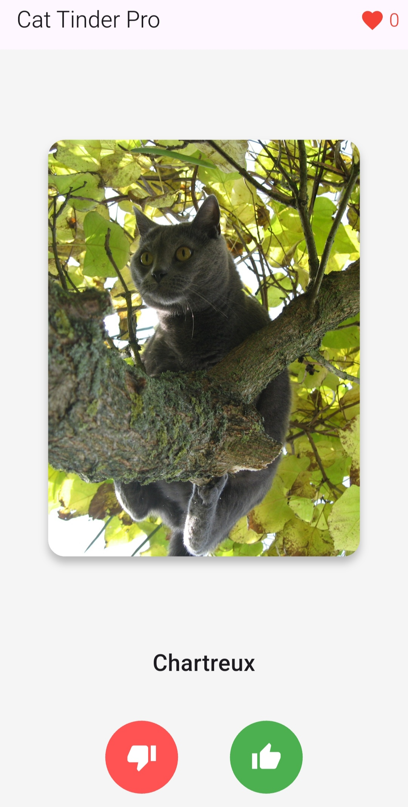
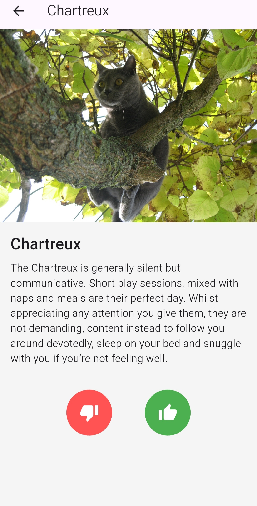
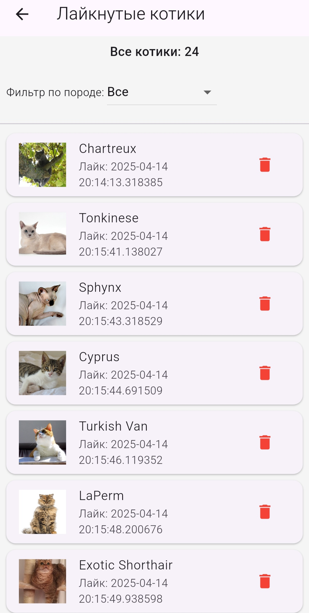

# Cat Tinder App

## Описание приложения
Cat Tinder — приложение для просмотра случайных фотографий кошек с указанием их пород. Пользователи могут свайпать вправо, чтобы добавить кота в избранное, или влево, чтобы перейти к следующему. Приложение отображает количество лайков и позволяет изучать подробности о породах. Нажатие на изображение открывает экран с расширенной информацией о выбранной породе.

## Реализованные функции
- Показ случайного изображения кота и названия породы на главном экране.
- Свайп влево (пропуск) или вправо (лайк) для взаимодействия.
- Альтернативные кнопки "Лайк" и "Дизлайк" для выбора действия.
- Автоматическая замена кота после свайпа или нажатия кнопки.
- Предзагрузка нескольких котиков в фоновом режиме для плавного перехода.
- Линейный прогресс-бар на главном экране с текстом "Загружаем котика...", скрывающий предзагрузку нескольких котиков для создания впечатления загрузки одного кота за раз.
- Счетчик лайков, обновляемый в реальном времени.
- Переход к детальной информации о породе при тапе на изображение.
- Экран с описанием породы: история происхождения, особенности темперамента, внешние характеристики.
- Полное отображение изображений котиков на экране детальной информации без обрезки, с возможностью увеличения (до 8x) и прокрутки через жесты, включая поддержку изображений, занимающих всю ширину экрана.
- Список лайкнутых котиков с фильтром по породе и возможностью удаления.

## Скриншоты
### Загрузка


### Главный экран


### Описание породы


### Список лайкнутых котиков


### Выбранная порода


## Скачать
[APK для Android](https://github.com/Chamistery/FlutterTasks/releases/tag/V.2)

## Технологии
- Flutter
- Dart
- BLoC для управления состоянием
- CachedNetworkImage для загрузки изображений
- GetIt для внедрения зависимостей

## Запуск
1. Установите Flutter SDK.
2. Клонируйте репозиторий (код про версии лежит в папке *Cat Tinder Pro*):
   ```
   git clone https://github.com/Chamistery/FlutterTasks.git
   ```
3. Установите зависимости:
   ```
   flutter pub get
   ```
4. Запустите Android эмулятор или подключите Android устройство.
5. Запустите приложение:
   ```
   flutter run
   ```
