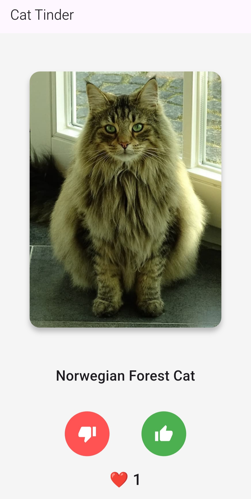
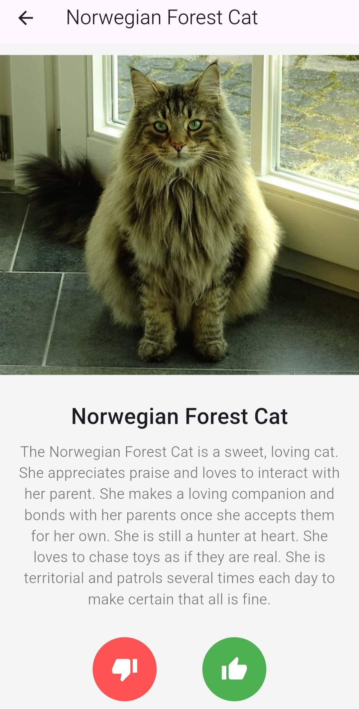

# Cat Tinder App

## Описание приложения
Cat Tinder — приложение для просмотра случайных фотографий кошек с указанием их пород. Пользователи могут свайпать вправо, чтобы добавить кота в избранное, или влево, чтобы перейти к следующему. Приложение отображает количество лайков и позволяет изучать подробности о породах. Нажатие на изображение открывает экран с расширенной информацией о выбранной породе.

## Реализованные функции
- Показ случайного изображения кота и названия породы на главном экране.
- Свайп влево (пропуск) или вправо (лайк) для взаимодействия.
- Альтернативные кнопки "Лайк" и "Дизлайк" для выбора действия.
- Автоматическая замена кота после свайпа или нажатия кнопки.
- Подгрузка следующего кота заранее.
- Счетчик лайков, обновляемый в реальном времени.
- Переход к детальной информации о породе при тапе на изображение.
- Экран с описанием породы: история происхождения, особенности темперамента, внешние характеристики.
- Изменение масштаба (приближение и отдаление картинки) котика на экране детальной информации.

## Скриншоты
### Главный экран


### Описание породы


## Скачать
[APK для Android](https://github.com/Chamistery/FlutterTasks/releases/tag/Latest)

## Технологии
- Flutter
- Dart

## Запуск
1. Установите Flutter SDK.
1. Клонируйте репозиторий:
```
git clone https://github.com/Chamistery/FlutterTasks.git
```
1. Установите зависимости:
```
flutter pub get
```
1. Запустите Android эмулятор или подключите Android устройство
1. Запустите приложение:
```
flutter run
```
